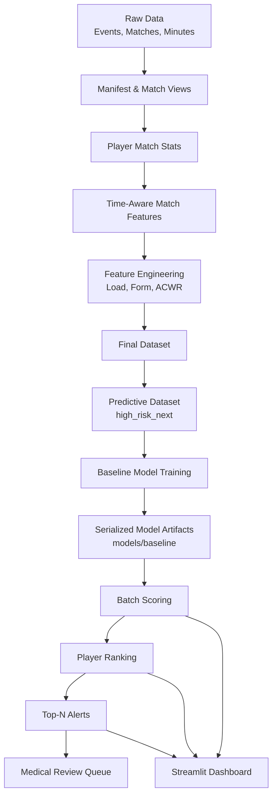

# ⚽ Football Risk Analytics

### Building end-to-end decision systems for football: from data to actionable insights under real-world constraints.

[]()
[]()
[]()
[](LICENSE)

---

## Quick Links

- [Architecture](docs/architecture.md)
- [Feature Catalog](docs/feature_catalog.md)
- [Inference](docs/inference.md)

---

## Index

- [Overview](#overview)
- [Key Results](#key-results)
- [Key Features](#key-features)
- [Key Technologies](#key-technologies)
- [Project Structure](#project-structure)
- [Pipeline Overview](#pipeline-overview)
- [Core Tables](#core-tables)
- [Quickstart](#quickstart)
- [Run the Full Pipeline](#run-the-full-pipeline)
- [Train the Model](#train-the-model)
- [Batch Scoring, Ranking, and Alerts](#batch-scoring-ranking-and-alerts)
- [Dashboard](#dashboard)
- [Modeling Approach](#modeling-approach)
- [Evaluation Strategy](#evaluation-strategy)
- [Operational Policy Simulation](#operational-policy-simulation)
- [Model Governance](#model-governance)
- [Outputs](#outputs)
- [Documentation](#documentation)
- [Project Status](#project-status)
- [Limitations](#limitations)
- [Future Improvements](#future-improvements)
- [Professional Context](#professional-context)
- [Author](#author)
- [License](#license)

---

## Overview

This project develops a **governance-oriented workload risk monitoring framework** for professional football.

Instead of predicting injuries directly, the system estimates **short-term elevated workload exposure** and ranks players under **realistic operational constraints**.

The focus is on:

- Interpretability
- Temporal robustness
- Calibration stability
- Operational decision support

The repository now includes an **end-to-end analytical pipeline** that goes beyond notebook experimentation:

- feature engineering on DuckDB
- modular training and inference code under `src/`
- batch risk scoring
- player ranking
- medical review queue generation
- Streamlit dashboard for operational review

---

## Key Results

### Chronological Hold-out

| Metric | Value |
|------|------|
| ROC-AUC | ~0.77 |
| PR-AUC | ~0.70 |
| Brier Score | ~0.20 |
| Precision @10% | ~0.75 |
| Recall @10% | ~0.15 |

### Rolling Backtest (4 Seasons)

| Metric | Mean |
|------|------|
| ROC-AUC | ~0.75 |
| PR-AUC | ~0.79 |
| Brier Score | ~0.19 |
| ECE | ~0.18 |

### Key Findings

- Logistic regression outperformed gradient boosting in **temporal stability**
- Calibration remained stable across competitive phases
- Score drift reflects **true workload volatility**, not model failure
- Fixed-capacity policy introduces **realistic operational trade-offs**
- The project now supports **batch scoring, ranking, and alert generation** on top of the modeling framework

---

## Key Features

- ✅ Strict chronological validation (no leakage)
- ✅ Multi-season rolling backtesting (walk-forward)
- ✅ Capacity-constrained decision simulation (top 10%)
- ✅ Calibration monitoring (ECE, Brier)
- ✅ Drift detection (PSI, label shift)
- ✅ Model robustness experiments
- ✅ Interpretability-first modeling (Logistic Regression)
- ✅ Production-style data pipeline (DuckDB lakehouse)
- ✅ Modular `src/` package for features, modeling, and inference
- ✅ Batch scoring pipeline with exported predictions
- ✅ Ranked player risk outputs and medical review queue
- ✅ Streamlit dashboard for operational inspection

---

## Key Technologies

- **Python**
- **DuckDB** (analytical lakehouse)
- **Polars / Pandas**
- **Scikit-learn**
- **SQL-based feature engineering**
- **Streamlit**
- **Joblib**

---

## Project Structure

```bash
football-risk-analytics/
│
├── app/
│   └── app.py
│
├── config/
│   └── base.yaml
│
├── docs/
│   ├── architecture.md
│   ├── feature_catalog.md
│   └── inference.md
│
├── models/
│   └── baseline/
│       ├── metadata.json
│       └── model.pkl
│
├── notebooks/
│   ├── 00_feature_engineering_workload_upgrade.ipynb
│   ├── 01_eda_risk_scouting.ipynb
│   ├── 02_model_high_risk_baseline.ipynb
│   ├── 03_model_comparison_logit_vs_hgb.ipynb
│   ├── 04_operational_thresholding.ipynb
│   └── 05_rolling_backtest_and_monitoring_optimized.ipynb
│
├── outputs/
│   ├── alerts/
│   │   ├── medical_review_queue.csv
│   │   ├── ranked_players.csv
│   │   └── top_players_alerts.csv
│   └── predictions/
│       ├── player_risk_scores.csv
│       └── player_risk_scores.parquet
│
├── scripts/
│   ├── 01_build_manifest.py
│   ├── 02_build_matches_view.py
│   ├── 03_build_player_match_stats.py
│   ├── 04_build_player_match_features_true_time.py
│   ├── 05_build_player_form_features.py
│   ├── 06_build_player_load_features_true.py
│   ├── 07_build_player_acwr_true.py
│   ├── 08_build_player_dataset_final.py
│   ├── 09_build_player_dataset_predictive.py
│   ├── 10_score_batch.py
│   ├── 11_rank_players.py
│   ├── 12_generate_alerts.py
│   ├── 20_train_baseline.py
│   ├── check_db.py
│   ├── ingestion/
│   └── legacy/
│
├── src/
│   └── football_risk_analytics/
│       ├── features/
│       │   ├── acwr.py
│       │   ├── dataset_final.py
│       │   ├── dataset_predictive.py
│       │   └── load_features.py
│       ├── inference/
│       │   ├── generate_alerts.py
│       │   ├── load_model.py
│       │   ├── rank_players.py
│       │   └── score_batch.py
│       └── modeling/
│           └── train_baseline.py
│
├── tests/
│   └── test_placeholder.py
│
├── Makefile
├── LICENSE
├── README.md
├── requirements.txt
└── run_pipeline.sh
```

---

## Pipeline Overview

The project follows a lakehouse-style architecture and now includes both **analytical modeling** and **operational inference**.



---

## Core Tables

- `matches`
- `player_match_stats`
- `player_match_features_true_time`
- `player_form_features`
- `player_load_features_true`
- `player_acwr_true`
- `player_dataset_final`
- `player_dataset_predictive`

---

## Quickstart

```bash
git clone https://github.com/yourusername/football-risk-analytics.git
cd football-risk-analytics
pip install -r requirements.txt
```

### Optional virtual environment

**Windows (Git Bash):**
```bash
python -m venv .venv
source .venv/Scripts/activate
```

**Linux / macOS:**
```bash
python3 -m venv .venv
source .venv/bin/activate
```

---

## Run the Full Pipeline

### Recommended on Windows / Git Bash

```bash
bash run_pipeline.sh
```

### Or step by step

```bash
PYTHONPATH=src python scripts/01_build_manifest.py
PYTHONPATH=src python scripts/02_build_matches_view.py
PYTHONPATH=src python scripts/03_build_player_match_stats.py
PYTHONPATH=src python scripts/04_build_player_match_features_true_time.py
PYTHONPATH=src python scripts/05_build_player_form_features.py
PYTHONPATH=src python scripts/06_build_player_load_features_true.py
PYTHONPATH=src python scripts/07_build_player_acwr_true.py
PYTHONPATH=src python scripts/08_build_player_dataset_final.py
PYTHONPATH=src python scripts/09_build_player_dataset_predictive.py
PYTHONPATH=src python scripts/20_train_baseline.py
PYTHONPATH=src python scripts/10_score_batch.py
PYTHONPATH=src python scripts/11_rank_players.py
PYTHONPATH=src python scripts/12_generate_alerts.py
```

### Makefile targets

If `make` is available in your environment:

```bash
make build-data
make train
make score
make rank
make alerts
make all
```

---

## Train the Model

```bash
PYTHONPATH=src python scripts/20_train_baseline.py
```

Artifacts are stored in:

```bash
models/baseline/model.pkl
models/baseline/metadata.json
```

---

## Batch Scoring, Ranking, and Alerts

### Batch scoring

```bash
PYTHONPATH=src python scripts/10_score_batch.py
```

### Ranking players by risk

```bash
PYTHONPATH=src python scripts/11_rank_players.py
```

### Generating top-risk alerts and medical review queue

```bash
PYTHONPATH=src python scripts/12_generate_alerts.py
```

---

## Dashboard

The repository includes a Streamlit dashboard to inspect:

- top risk players
- ranking outputs
- alert tables
- medical review queue
- basic team-level summaries

Run it with:

```bash
streamlit run app/app.py
```

---

## Modeling Approach

### Baseline Model

- Logistic Regression
- Target: `high_risk_next`
- Current implementation: simple saved estimator baseline
- Operational artifact storage under `models/baseline/`

### Why Logistic Regression?

- Stable under temporal drift
- Interpretable coefficients
- Lower variance vs complex models
- Better governance properties

### Benchmark

- HistGradientBoosting (comparison only)

### Current modeling note

The current baseline training and inference pipeline is operational and serializes a trained estimator.  
A future upgrade should encapsulate:

- `SimpleImputer`
- `StandardScaler`
- `LogisticRegression`

inside a single scikit-learn `Pipeline`.

---

## Evaluation Strategy

### 1. Chronological Split

Simulates first deployment.

### 2. Rolling Walk-Forward

- 4 seasons
- 22 validation windows
- Non-stationary environment simulation

### 3. Operational Inference Layer

The project now extends beyond offline evaluation by generating:

- batch player scores
- within-date rankings
- top-risk alerts
- medical review queues

---

## Operational Policy Simulation

The system enforces **real-world constraints**:

- Only top **10% highest-risk players** are flagged in the research evaluation setting
- Threshold selected on training data
- Evaluated under test-time drift
- Operational demo layer currently supports **Top-N alert generation per match date**

This mirrors **limited medical staff capacity**.

---

## Model Governance

Monitoring framework includes:

- Calibration tracking (ECE, Brier)
- Score distribution drift (PSI)
- Label prevalence monitoring
- Alert rate deviation
- Control-style stability tracking

### Trigger-based actions

- Recalibration
- Retraining
- Threshold adjustment

### Operational governance extension

The repository now also includes exportable outputs that support review workflows:

- scored prediction files
- ranked player views
- medical queue generation
- dashboard inspection

---

## Outputs

### Predictions

- `outputs/predictions/player_risk_scores.csv`
- `outputs/predictions/player_risk_scores.parquet`

### Ranked outputs

- `outputs/alerts/ranked_players.csv`
- `outputs/alerts/ranked_players.parquet`

### Alert outputs

- `outputs/alerts/top_players_alerts.csv`
- `outputs/alerts/medical_review_queue.csv`

These outputs make the project usable not only as a modeling exercise but also as an **operational analytical prototype**.

---

---

## Documentation

The repository includes detailed technical documentation under the `docs/` folder to complement the codebase and provide system-level understanding.

### Architecture

High-level system design, data flow, and layer separation:

- `docs/architecture.md`

Covers:
- pipeline structure and data flow
- separation between feature, modeling, and inference layers
- DuckDB-based analytical architecture
- orchestration logic and execution modes

---

### Feature Catalog

Detailed description of all modeling features and their interpretation:

- `docs/feature_catalog.md`

Covers:
- workload features (acute, chronic, ACWR)
- form and rolling features
- match-level metrics
- target definition (`high_risk`, `high_risk_next`)
- feature lineage and design rationale

---

### Inference Layer

Operational scoring, ranking, and alert generation:

- `docs/inference.md`

Covers:
- batch scoring pipeline
- model loading and feature usage
- ranking logic
- alert generation and medical review queue
- inference flow and operational interpretation

---

### Why this matters

These documents are designed to make the project understandable not only as code, but as a **complete analytical system**, including:

- data lineage
- modeling intent
- operational decision support
- governance considerations

---

## Project Status

Current maturity level:

- **Analytical pipeline:** implemented
- **Baseline training:** implemented
- **Batch inference:** implemented
- **Ranking and alerting:** implemented
- **Dashboard:** implemented
- **MLOps hardening:** partial / future work

This repository now behaves as a **production-style analytical prototype**, not only as a notebook-based research project.

---

## Limitations

- Proxy risk signal (not real injuries)
- No GPS / training load data
- No biomechanical inputs
- High non-stationarity in workload dynamics
- Current baseline training should be upgraded to a full sklearn preprocessing pipeline
- Operational layer is batch-oriented, not yet exposed as an API or scheduled service

---

## Future Improvements

- Hybrid model (workload + performance)
- Bayesian temporal smoothing
- Dynamic thresholding policies
- Real-time monitoring dashboard
- Automated retraining pipeline
- Full sklearn `Pipeline` with imputation and scaling
- Model registry and version tracking
- Backtesting outputs exported as formal reports
- Real-time or API-based inference

---

## Professional Context

This project demonstrates:

- Time-aware validation under non-stationarity
- Operational decision support under constraints
- Calibration and drift monitoring
- Model robustness vs performance trade-offs
- Governance-first ML design
- Modular feature, modeling, and inference code organization
- End-to-end analytical system design for football performance operations

---

## Author

**Manuel Pérez Bañuls**  
Data Scientist | Football Analytics Enthusiast | Probabilistic Modeling

Specializing in:
- Sports analytics and forecasting
- Probabilistic simulation systems
- Machine learning for football prediction
- Production-ready data pipelines

**Connect & Collaborate**:
- 📧 Email: [manuelpeba@gmail.com](mailto:manuelpeba@gmail.com)
- 💼 LinkedIn: [manuel-perez-banuls](https://www.linkedin.com/in/manuel-perez-banuls/)
- 🐙 GitHub: [manuelpeba](https://github.com/manuelpeba)

Interested in discussing sports analytics, forecasting systems, or data-driven decision-making? Feel free to reach out.

---

## License

MIT License
