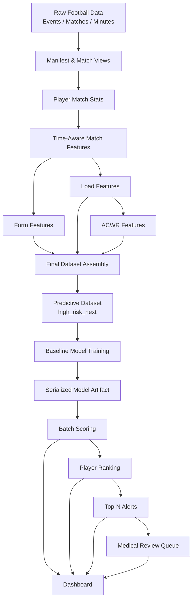

# Architecture

## Purpose

This repository implements a governance-oriented workload risk monitoring system for professional football. The project is designed as an end-to-end analytical pipeline that transforms raw football event and match data into:

- engineered workload and form features
- a predictive modeling dataset
- a trained baseline risk model
- batch risk scores for players
- ranked player outputs
- alert lists and a medical review queue
- a lightweight dashboard for operational inspection

The system is intentionally structured to balance three goals:

1. **Analytical rigor** — strict chronological validation and walk-forward thinking.
2. **Operational realism** — constrained review capacity and actionable ranking outputs.
3. **Governance** — emphasis on interpretability, calibration, drift awareness, and reproducibility.

---

## Architectural Principles

### 1. Time-aware design
All core transformations and modeling steps are designed around chronological integrity. Rolling features are computed using historical context only, and the predictive target is shifted forward by player-season trajectory.

### 2. Separation of concerns
The repository distinguishes between:

- **scripts/** for orchestration and execution entrypoints
- **src/** for reusable feature, modeling, and inference logic
- **models/** for serialized artifacts
- **outputs/** for operational outputs
- **docs/** for technical documentation
- **notebooks/** for research, EDA, and experimentation

### 3. Operational outputs as first-class artifacts
The pipeline does not stop at model training. It explicitly produces downstream operational artifacts such as rankings and a medical review queue.

### 4. Production-style local architecture
This is a local analytical prototype rather than a cloud-native production system, but it adopts a production-style layout:
- modular code
- persisted artifacts
- explicit pipeline stages
- distinct outputs
- dashboard layer

---

## Repository Layers

## 1. Data / Storage Layer

### DuckDB lakehouse
The project uses DuckDB as the local analytical backbone. It behaves as a compact local warehouse/lakehouse for:

- bronze/raw parquet-backed inputs
- derived analytical views
- feature tables
- final modeling datasets

### Storage zones
The conceptual storage pattern is:

- **raw / bronze**: exported events, matches, minutes data
- **silver**: intermediate feature tables
- **gold**: final datasets and prediction-ready tables

Although not all zones are formalized as separate folders in a warehouse sense, the table design follows this layered logic.

---

## 2. Feature Engineering Layer

Implemented primarily under:

- `src/football_risk_analytics/features/`
- orchestrated by scripts `01` through `09`

This layer creates the core analytical tables:

- `matches`
- `player_match_stats`
- `player_match_features_true_time`
- `player_form_features`
- `player_load_features_true`
- `player_acwr_true`
- `player_dataset_final`
- `player_dataset_predictive`

### Design logic
Feature engineering combines:

- event-derived match statistics
- time-aware match-minute data
- rolling workload windows
- short-term performance form
- workload ratio logic (ACWR)
- forward target construction

---

## 3. Modeling Layer

Implemented under:

- `src/football_risk_analytics/modeling/`
- orchestrated by `scripts/20_train_baseline.py`

Current baseline:
- Logistic Regression
- target: `high_risk_next`

Artifacts are persisted under:
- `models/baseline/model.pkl`
- `models/baseline/metadata.json`

### Current maturity
This layer is operational, but still intentionally simple. The next hardening step is to move from a bare estimator to a full scikit-learn `Pipeline` including imputation and scaling.

---

## 4. Inference Layer

Implemented under:

- `src/football_risk_analytics/inference/`

This layer provides:
- model loading
- batch scoring
- ranking by risk
- top-N alert generation
- medical review queue generation

Generated outputs include:

- `outputs/predictions/player_risk_scores.csv`
- `outputs/alerts/ranked_players.csv`
- `outputs/alerts/top_players_alerts.csv`
- `outputs/alerts/medical_review_queue.csv`

This is the layer that converts the project from a pure research exercise into an operational analytical prototype.

---

## 5. Dashboard Layer

Implemented in:

- `app/app.py`

The Streamlit app consumes exported files from the inference layer and supports:
- filtering by match date
- filtering by team
- reviewing top risk players
- reviewing alert tables
- inspecting the medical review queue
- summarizing filtered risk information

The dashboard is intentionally lightweight and downstream of exported outputs, which keeps it simple and reproducible.

---

## 6. Documentation Layer

Documentation lives in:

- `README.md`
- `docs/architecture.md`
- `docs/feature_catalog.md`
- `docs/inference.md`

The purpose of this layer is to make the pipeline understandable not only as code, but as a system with:
- data lineage
- modeling intent
- operational semantics
- governance rationale

---

## End-to-End Flow

---

## Orchestration Flow

The current orchestration is file-based and local.

### Main scripts
- `01_build_manifest.py`
- `02_build_matches_view.py`
- `03_build_player_match_stats.py`
- `04_build_player_match_features_true_time.py`
- `05_build_player_form_features.py`
- `06_build_player_load_features_true.py`
- `07_build_player_acwr_true.py`
- `08_build_player_dataset_final.py`
- `09_build_player_dataset_predictive.py`
- `20_train_baseline.py`
- `10_score_batch.py`
- `11_rank_players.py`
- `12_generate_alerts.py`

### Execution modes
- individual script execution
- `run_pipeline.sh` for Windows/Git Bash friendly orchestration
- `Makefile` for environments where `make` is available

---

## Data Contracts Between Layers

## Feature layer -> Modeling layer
Input expectation:
- one row per player-match
- consistent feature schema
- no leakage from future observations
- target available for training datasets

## Modeling layer -> Inference layer
Artifacts expected:
- serialized model (`model.pkl`)
- metadata (`metadata.json`)

## Inference layer -> Dashboard layer
Files expected:
- prediction CSV/parquet
- ranking CSV/parquet
- alert CSV
- medical queue CSV

---

## Key Tables and Their Roles

## `matches`
Canonical match-level date information.

## `player_match_stats`
Aggregated event-level match stats per player.

## `player_match_features_true_time`
Time-aware player-match features using more reliable minute information.

## `player_form_features`
Short-term performance trend features.

## `player_load_features_true`
Rolling workload windows over time.

## `player_acwr_true`
Workload ratio table using the chosen ACWR formulation.

## `player_dataset_final`
Integrated feature table used as the base for downstream scoring.

## `player_dataset_predictive`
Modeling dataset with `high_risk_next` target.

---

## Why This Architecture Works

This architecture is effective for the project because it:

- preserves chronological integrity
- keeps analytical logic modular
- distinguishes research code from operational code
- produces interpretable artifacts
- supports repeatable local execution
- makes the system demonstrable to non-technical stakeholders

It is intentionally not over-engineered. For a portfolio or club-facing analytical prototype, the current structure is strong enough to demonstrate maturity while remaining easy to understand.

---

## Current Gaps and Future Architectural Evolution

### Current gaps
- no formal scheduler
- no API layer
- no model registry beyond simple files
- dashboard reads exported files rather than a live service
- baseline model training is not yet wrapped in a preprocessing pipeline
- limited automated testing

### Natural next architectural upgrades
- scikit-learn `Pipeline` for modeling
- model version registry
- threshold policy file (`threshold.json`)
- monitoring report generation as artifacts
- scheduled batch runs
- API endpoint for live scoring
- richer dashboard with model explainability or drill-down

---

## Summary

The repository architecture is designed to support the full analytical lifecycle:

**data -> features -> dataset -> model -> scores -> ranking -> alerts -> dashboard**

That end-to-end structure is the main architectural strength of the project. It demonstrates that the system is not only capable of producing a model, but also of producing usable operational outputs under realistic football performance workflows.
