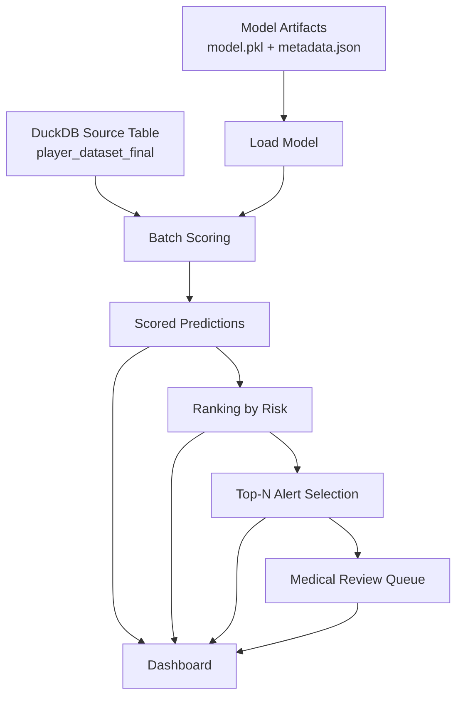

# Inference Layer

## Purpose

The inference layer is responsible for turning a trained baseline model into operational outputs that staff can inspect and use.

In this repository, inference is implemented as a **batch workflow** rather than a live API. It reads persisted model artifacts, scores players, ranks them by risk, and generates alert tables.

This layer is what transforms the project from a modeling prototype into a usable operational analytical system.

---

## Scope of the Inference Layer

The current inference layer supports four main tasks:

1. loading the serialized baseline model
2. batch scoring player observations
3. ranking players by risk
4. generating top-risk alerts and a medical review queue

Implemented modules:

- `src/football_risk_analytics/inference/load_model.py`
- `src/football_risk_analytics/inference/score_batch.py`
- `src/football_risk_analytics/inference/rank_players.py`
- `src/football_risk_analytics/inference/generate_alerts.py`

Execution scripts:

- `scripts/10_score_batch.py`
- `scripts/11_rank_players.py`
- `scripts/12_generate_alerts.py`

---

## Inference Inputs

## 1. Model artifacts

Expected model directory:

```text
models/baseline/
├── model.pkl
└── metadata.json
```

### `model.pkl`
Serialized trained estimator.

### `metadata.json`
Lightweight metadata for model name, version, and context. Example fields include:

- `model_name`
- `model_version`
- `target`
- `source_table`

---

## 2. Feature source table

Current scoring source table:
- `player_dataset_final`

This table provides:
- identifier columns
- context columns
- model features needed for scoring

The inference layer currently scores the integrated feature table directly and outputs risk scores row by row.

---

## Batch Scoring

## Goal
Generate a risk score per player observation and export a scored dataset.

### Module
- `src/football_risk_analytics/inference/score_batch.py`

### Script
- `scripts/10_score_batch.py`

### Main responsibilities
- load serialized model
- query feature data from DuckDB
- select scoring features
- handle missing values
- run model inference
- export prediction files

### Default output files
- `outputs/predictions/player_risk_scores.csv`
- `outputs/predictions/player_risk_scores.parquet`

---

## Scoring Schema

### Identifier/context fields retained
The scoring output retains operational identifiers such as:

- `player_id`
- `competition_id`
- `season_id`
- `match_id`
- `match_date`
- `team`

### Added inference fields
- `risk_score`
- `model_name`
- `model_version`
- `scored_at_utc`

This design ensures the scored output is both traceable and operationally usable.

---

## Current Scoring Feature Set

The baseline batch scorer currently uses:

- `shots_per90`
- `xg_per90`
- `passes_per90`
- `carries_per90`
- `progressive_x_per90`
- `xg_last_5`
- `shots_last_5`
- `progressive_last_5`
- `trend_xg_3v3`
- `minutes_last_7d`
- `minutes_last_14d`
- `minutes_last_28d`
- `minutes_last_5_matches`
- `acwr`

These are currently defined directly in the scorer module as a default feature list.

---

## Missing Value Handling

This is an important operational detail.

### Why missing values occur
Missing values may be present because of:
- limited historical lookback
- ACWR validity thresholds
- left joins in final dataset assembly
- incomplete recent sequence context

### Current handling
The current batch scorer fills missing numeric values before prediction.

This is a pragmatic operational solution that unblocks inference.

### Recommended future handling
The preferred long-term solution is to move preprocessing inside the serialized training artifact using a sklearn `Pipeline`:

- `SimpleImputer`
- `StandardScaler`
- `LogisticRegression`

That would ensure training and inference transformations are guaranteed to be consistent.

---

## Ranking

## Goal
Transform scored observations into ordered risk views.

### Module
- `src/football_risk_analytics/inference/rank_players.py`

### Script
- `scripts/11_rank_players.py`

### Function
The ranking layer sorts by risk score and assigns a ranking value.

### Current logic
The current implementation ranks players **within each match date** when date information is present.

This is a strong operational choice because it makes the output easier to inspect in a review workflow: for a given day or match context, staff can see the most relevant cases first.

### Output files
- `outputs/alerts/ranked_players.csv`
- `outputs/alerts/ranked_players.parquet`

### Added field
- `risk_rank`

---

## Alert Generation

## Goal
Convert ranked outputs into a staff-facing review list.

### Module
- `src/football_risk_analytics/inference/generate_alerts.py`

### Script
- `scripts/12_generate_alerts.py`

### Current logic
The first operational policy is a simple **Top-N rule per match date**.

Example:
- select the top 10 highest-risk player rows within each date

This creates a controlled alert list and mimics a constrained review process.

### Output files
- `outputs/alerts/top_players_alerts.csv`
- `outputs/alerts/medical_review_queue.csv`

---

## Medical Review Queue

The medical review queue is a simplified operational file derived from the top-risk alerts.

### Purpose
Provide a concise table that can be consumed by staff without requiring full model metadata.

### Current fields
- `match_date`
- `player_id`
- `team`
- `risk_score`
- `risk_rank`

This file is intentionally compact and decision-oriented.

---

## Inference Flow



---

## Execution Flow

A typical manual inference run is:

### 1. Train the model
```bash
PYTHONPATH=src python scripts/20_train_baseline.py
```

### 2. Score the dataset
```bash
PYTHONPATH=src python scripts/10_score_batch.py
```

### 3. Rank players
```bash
PYTHONPATH=src python scripts/11_rank_players.py
```

### 4. Generate alerts
```bash
PYTHONPATH=src python scripts/12_generate_alerts.py
```

### 5. Review outputs in dashboard
```bash
streamlit run app/app.py
```

---

## Integration with the Dashboard

The Streamlit dashboard reads the exported inference files rather than scoring data on demand.

### Benefits of this approach
- simpler architecture
- reproducible outputs
- easier debugging
- decoupled UI from model execution
- useful for demos and local workflows

### Trade-off
It is not real-time inference. It is a file-based batch review system.

For the current stage of the project, that is a sensible choice.

---

## Operational Interpretation of Risk Score

The `risk_score` produced by the model should be interpreted as:

- a model-derived signal of elevated next-observation workload risk proxy
- useful for ranking and prioritization
- not a direct injury probability
- not a medical diagnosis

The score is designed to support review prioritization rather than automatic intervention.

---

## Policy Layer vs Model Layer

It is important to distinguish:

### Model layer
Produces a continuous score.

### Policy layer
Determines what to do with that score.

Current policy examples:
- rank all players
- select top N per date
- create a medical review queue

This distinction is central to governance. It keeps the model objective separate from operational capacity decisions.

---

## Current Constraints and Caveats

### 1. Batch-only execution
The current system is not exposed as an API or service.

### 2. Baseline estimator simplicity
The model is operational but not yet encapsulated in a hardened preprocessing pipeline.

### 3. Threshold policy is simple
Alert generation currently uses Top-N logic rather than a more flexible threshold registry.

### 4. No explanation layer yet
The inference outputs do not yet include feature contribution explanations or local interpretability diagnostics.

### 5. No scheduler
Inference is triggered manually rather than via a timed job.

---

## Recommended Next Upgrades

### Inference hardening
- persist full sklearn preprocessing pipeline
- formalize feature schema checks
- add threshold policy artifact (`threshold.json`)
- add inference validation tests

### Operational upgrades
- allow top-percent alerting
- per-team alerting modes
- date-range filters in queue exports
- dashboard download buttons
- explanation or feature attribution views

### Productionization upgrades
- schedule batch runs
- add logging
- persist run metadata
- expose scoring as API endpoint
- write outputs back into DuckDB or a serving table

---

## Summary

The inference layer operationalizes the modeling work by producing:

- scored predictions
- ranked player outputs
- alert tables
- a concise medical review queue

Its role in the repository is essential: it bridges the gap between offline modeling and staff-facing decision support.

In short, the inference layer is the part of the system that makes the project actionable.
